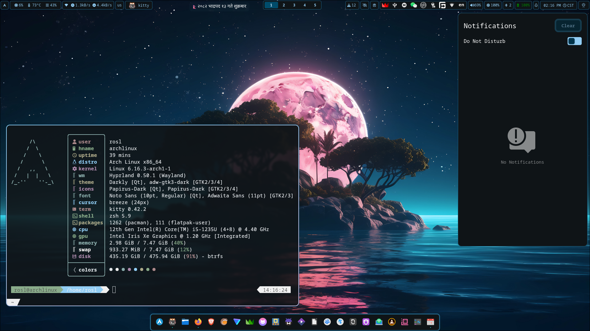

# dotfiles-hyprland
My dotfiles for hyprland in Arch Linux

## Preview
<p align="center">
  
</p>

## Instructions
1. Make a backup of your dotfiles.
2. Copy the dotfiles from this repo to the appropriate location.
3. Install the dependencies.
4. Either restart or logout and login (Recommended to restart).

NOTES:  
1. To update the color palate according to the wallpaper  
- Either  
change wallpapers using waypaper  
- OR Either  
Log Out and Login which will execute the auto start script for this
- OR  
use this command:
```
matugen image $(hyprctl hyprpaper listloaded)
```
  If this command doesnot work then replace `$(hyprctl hyprpaper listloaded)` with path to your wallpaper.  
  
2. If you want to use kde over gtk for file chooser portal then you can replace `xdg-desktop-portal-gtk` with `xdg-desktop-portal-kde`.  
  
3. For theming of gtk apps in flatpak do this command  
- For system wide flatpak apps  
```
sudo flatpak override \
--filesystem=~/.gtkrc-2.0:ro \
--filesystem=~/.config/gtk-3.0:ro \
--filesystem=~/.config/gtk-4.0:ro \
--filesystem=~/.icons:ro \
--filesystem=~/.local/share/icons:ro \
--filesystem=~/.themes:ro \
--filesystem=~/.local/share/themes:ro
```
- For User flatpak apps  
```
flatpak override --user \
--filesystem=~/.gtkrc-2.0:ro \
--filesystem=~/.config/gtk-3.0:ro \
--filesystem=~/.config/gtk-4.0:ro \
--filesystem=~/.icons:ro \
--filesystem=~/.local/share/icons:ro \
--filesystem=~/.themes:ro \
--filesystem=~/.local/share/themes:ro
```
4. I use `tuned-ppd` for power management. You can substitute it with `power-profiles-daemon`.
  
4. There is user.js file in .mozilla folder. There are some tweaks I like to use. If you want you can copy that to your firefox profile folder ie `~/.mozilla/(your profile)/user.js`.

## Dependencies
### Pacman pkgs
```
sudo pacman -S \
adw-gtk-theme \
archlinux-xdg-menu \
blueman \
bluez-utils \
breeze \
brightnessctl \
cliphist \
dolphin \
fastfetch \
firefox \
flatpak \
gnome-keyring \
hypridle \
hyprland \
hyprlock \
hyprpaper \
hyprpicker \
hyprpolkitagent \
hyprshot \
hyprsunset \
papirus-icon-theme \
xdg-desktop-portal-hyprland \
xdg-desktop-portal-gtk \
kate \
kio-admin \
kitty \
loupe \
nwg-dock-hyprland \
nwg-look \
pacman-contrib \
pavucontrol \
swaync \
ttf-hack-nerd \
tuned-ppd \
udiskie \
waybar \
wofi \
zsh \
zsh-autocomplete \
zsh-autosuggestions \
zsh-completions \
zsh-syntax-highlighting
```

### AUR Pkgs
```
yay -S \
darkly-bin \
hyprshell \
hyprsysteminfo \
matugen-bin \
oh-my-zsh-git \
oh-my-zsh-powerline-theme-git \
python-pywalfox \
qt5ct-kde \
qt6ct-kde \
waybar-updates \
waypaper \
wofi-emoji
```

### Flatpak Pkgs
```
flatpak install \
org.gnome.Calendar \
io.missioncenter.MissionCenter
```

### Extra pkgs
- Thumbnails some file types for dolphin  
(need to enable in dolphin settings after installation)
```
sudo pacman -S \
ffmpegthumbs \
icoutils \
kdegraphics-thumbnailers \
kimageformats \
libappimage
```
```
yay -S \
kde-thumbnailer-apk
```

- Nepali calendar Widget
```
yay -S \
nepdate
```
