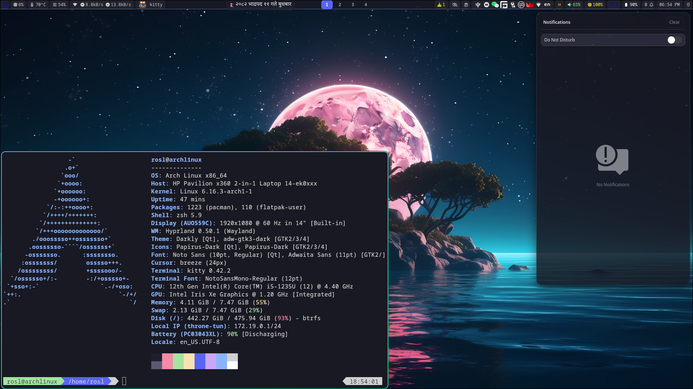
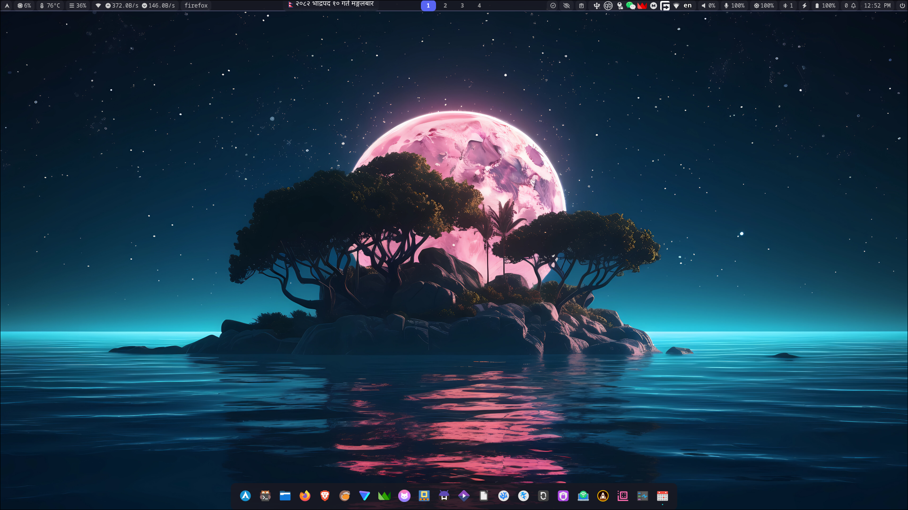

# dotfiles-hyprland
My dotfiles for hyprland in Arch Linux

## Preview
<p align="center">
  
  
</p>

## Instructions
1. Make a backup of your dotfiles.
2. Copy the dotfiles from this repo to the appropriate location.
3. Install the dependencies.
4. Either restart or logout and login (Recommended to restart).

## Dependencies
### Pacman pkgs
```
sudo pacman -S \
adw-gtk-theme \
archlinux-xdg-menu \
blueman \
bluez-utils \
breeze \
brightnessctl \
cliphist \
dolphin \
fastfetch \
gnome-keyring \
hypridle \
hyprland \
hyprlock \
hyprpaper \
hyprpicker \
hyprpolkitagent \
hyprshot \
hyprsunset \
papirus-icon-theme \
xdg-desktop-portal-hyprland \
kate \
kio-admin \
kitty \
loupe \
nwg-dock-hyprland \
nwg-look \
pacman-contrib \
pavucontrol \
swaync \
ttf-hack-nerd \
udiskie \
waybar \
wofi \
zsh \
zsh-autocomplete \
zsh-autosuggestions \
zsh-completions \
zsh-syntax-highlighting
```

### AUR Pkgs
```
yay -S \
darkly-bin \
hyprshell \
hyprsysteminfo \
oh-my-zsh-git \
oh-my-zsh-powerline-theme-git \
qt5ct-kde \
qt6ct-kde \
waybar-updates \
wofi-emoji
```

### Flatpak Pkgs
```
flatpak install \
org.gnome.Calendar \
io.missioncenter.MissionCenter
```

### Extra pkgs
- Thumbnails some file types for dolphin  
(need to enable in dolphin settings after installation)
```
sudo pacman -S \
ffmpegthumbs \
icoutils \
kdegraphics-thumbnailers \
kimageformats \
libappimage
```
```
yay -S \
kde-thumbnailer-apk
```
