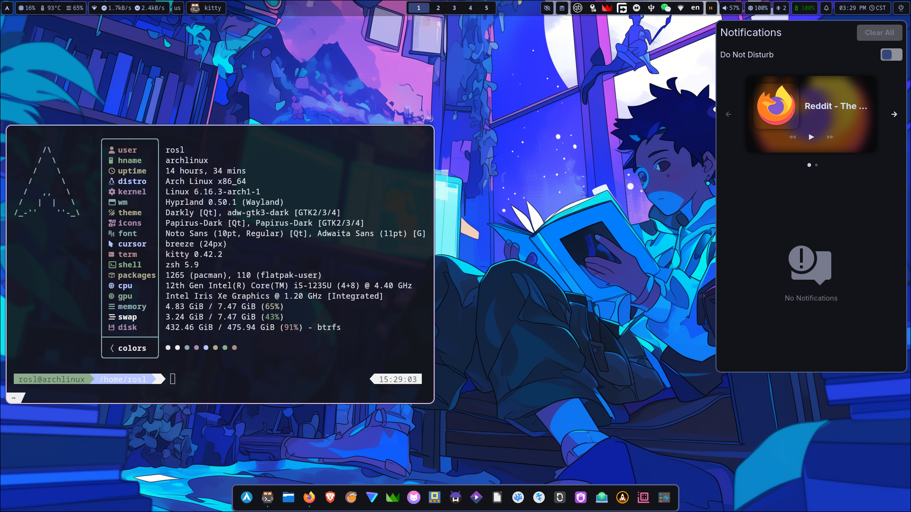

# dotfiles-hyprland  
My dotfiles for hyprland in Arch Linux  

## Preview  
<p align="center">
  
</p>
  
## Instructions  
1. Make a backup of your dotfiles.  
2. Copy the dotfiles from this repo to the appropriate location.  
3. Install the dependencies.  
4. Either restart or logout and login (Recommended to restart).  
  
NOTES:  
1. To update the color palate according to the wallpaper  
- Either  
change wallpapers using waypaper  
- OR Either  
Log Out and Login which will execute the auto start script for this  
- OR  
use this command:  
```
matugen image $(hyprctl hyprpaper listloaded)
```
  If this command doesnot work then replace `$(hyprctl hyprpaper listloaded)` with path to your wallpaper.  
  
2. If you want to use kde over gtk for file chooser portal then you can replace `xdg-desktop-portal-gtk` with `xdg-desktop-portal-kde`.  
  
3. For theming of gtk apps in flatpak do this command  
- For system wide flatpak apps  
```
sudo flatpak override \
--filesystem=~/.gtkrc-2.0:ro \
--filesystem=~/.config/gtk-3.0:ro \
--filesystem=~/.config/gtk-4.0:ro \
--filesystem=~/.icons:ro \
--filesystem=~/.local/share/icons:ro \
--filesystem=~/.themes:ro \
--filesystem=~/.local/share/themes:ro
```
- For User flatpak apps  
```
flatpak override --user \
--filesystem=~/.gtkrc-2.0:ro \
--filesystem=~/.config/gtk-3.0:ro \
--filesystem=~/.config/gtk-4.0:ro \
--filesystem=~/.icons:ro \
--filesystem=~/.local/share/icons:ro \
--filesystem=~/.themes:ro \
--filesystem=~/.local/share/themes:ro
```
4. I use `tuned-ppd` for power management. You can substitute it with `power-profiles-daemon`.  
    
5. There is user.js file in .mozilla folder. There are some tweaks I like to use. If you want you can copy that to your firefox profile folder ie `~/.mozilla/(your profile)/user.js`.  
  
6. Dolphin open with fix. Install `archlinux-xdg-menu` and make sure `env = XDG_MENU_PREFIX,arch-` is set on the hyprland config. (It is enabled on my configs and the pkg is in the pkg list below) then run `kbuildsyscoca6` once and it should be okay. If it somehow becomes empty again (installing `xdg-desktop-portal-kde` did it for me) then rerun the command again.  
  
7. HYPRLAND PLUGINS  
- `hyprpm` is used to install hyprland plugins  
- The official plugin repo can be added to hyprpm by  
```
hyprpm add https://github.com/hyprwm/hyprland-plugins
```
- Then to list all the available plugins  
```
hyprpm list
```
- To enable plugins  
eg: `hyprbars`  
```
hyprpm enable hyprbars
```
- To disable plugins  
eg: `hyprbars`  
```
hyprpm disable hyprbars
```
- To update plugins  
```
hyprpm update
```
- Ok now for the plugins and remotes I use hyprbars(for titlebars), hyprgrass (for touchscreen gestures), hyprexpo and Hyprspace (workspace overview)   
``` 
hyprpm add https://github.com/hyprwm/hyprland-plugins
sudo pacman -S glm #required by hyprgrass
sudo pacman -S meson ninja --asdeps #required by hyprgrass as makedeps
hyprpm add https://github.com/horriblename/hyprgrass
hyprpm add https://github.com/KZDKM/Hyprspace
hyprpm enable hyprbars
hyprpm enable hyprexpo
hyprpm enable hyprgrass
hyprpm enable Hyprspace
```
  
- If there is error during `hyprpm enable/disable` then run  
```
hyprpm update
```

8. In order to auto rotate when tilted on touch screen devices use `iio-hyprland-git` pkg.  
for it to work I had to specify my monitor in the hyprland config as  
```
monitor=eDP-1,preferred,auto,1,transform,0
```
If you want this feature replace `eDP-1` with your monitor name  
If you dont want this feature just use  
```
monitor=,preferred,auto,1
```
if you dont need auto rotate functionality  

9. On Screen Keyboard   
- I use `squeekboard`. Enable it by command   
```
gsettings set org.gnome.desktop.a11y.applications screen-keyboard-enabled true
```
then it can be launched with command   
```
squeekboard
```
- This keyboard is problamatic with fcitx5 so i have custom waybar module to enable/disable it.

## Dependencies
### Pacman pkgs
```
sudo pacman -S \
adw-gtk-theme \
archlinux-xdg-menu \
blueman \
bluez-utils \
breeze \
brightnessctl \
cliphist \
dolphin \
fastfetch \
firefox \
flatpak \
glm \
gnome-keyring \
hypridle \
hyprland \
hyprlock \
hyprpaper \
hyprpicker \
hyprpolkitagent \
hyprshot \
hyprsunset \
papirus-icon-theme \
xdg-desktop-portal-hyprland \
xdg-desktop-portal-gtk \
kate \
kio-admin \
kitty \
loupe \
nwg-dock-hyprland \
nwg-drawer \
nwg-look \
pacman-contrib \
pavucontrol \
squeekboard \
swaync \
ttf-hack-nerd \
tuned-ppd \
udiskie \
waybar \
wofi \
zsh \
zsh-autocomplete \
zsh-autosuggestions \
zsh-completions \
zsh-syntax-highlighting
```

### AUR Pkgs
```
yay -S \
darkly-bin \
hyprshell \
hyprsysteminfo \
iio-hyprland-git \
matugen-bin \
oh-my-zsh-git \
oh-my-zsh-powerline-theme-git \
python-pywalfox \
qt5ct-kde \
qt6ct-kde \
waybar-updates \
waypaper \
wofi-emoji
```

### Flatpak Pkgs
```
flatpak install \
io.github.kolunmi.Bazaar \
io.missioncenter.MissionCenter \
org.gnome.Calendar \
org.kde.kamoso
```

### Extra pkgs
- Thumbnails some file types for dolphin  
(need to enable in dolphin settings after installation)
```
sudo pacman -S \
ffmpegthumbs \
icoutils \
kdegraphics-thumbnailers \
kimageformats \
libappimage
```
```
yay -S \
kde-thumbnailer-apk
```

- Nepali calendar Widget
```
yay -S \
nepdate
```
  
- yaft (yet another framebuffer terminal)  
```
yay -S \
yaft-git
```
  
- Chawan (Terminal internet browser-requires yaft for image rendering in tty)  
```
yay -S \
chawan
```
